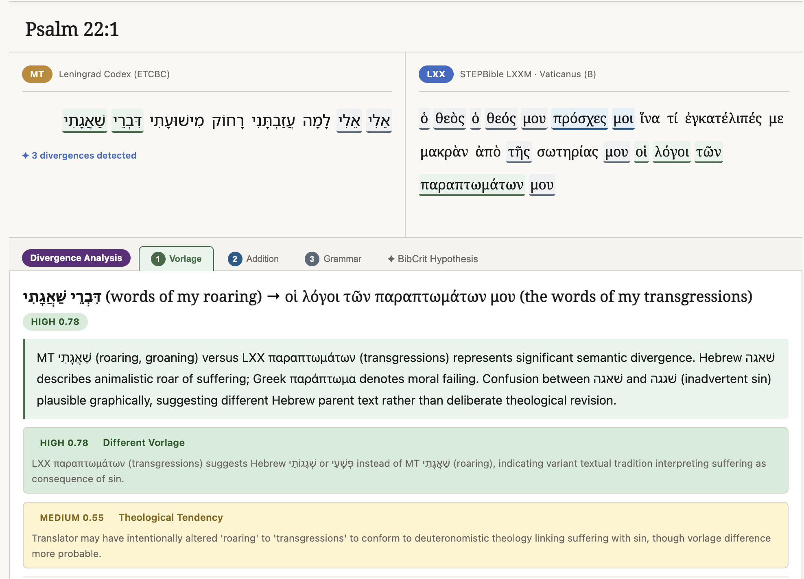
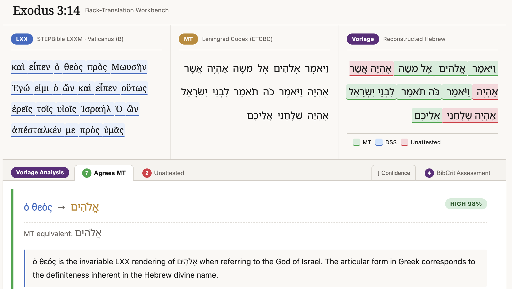
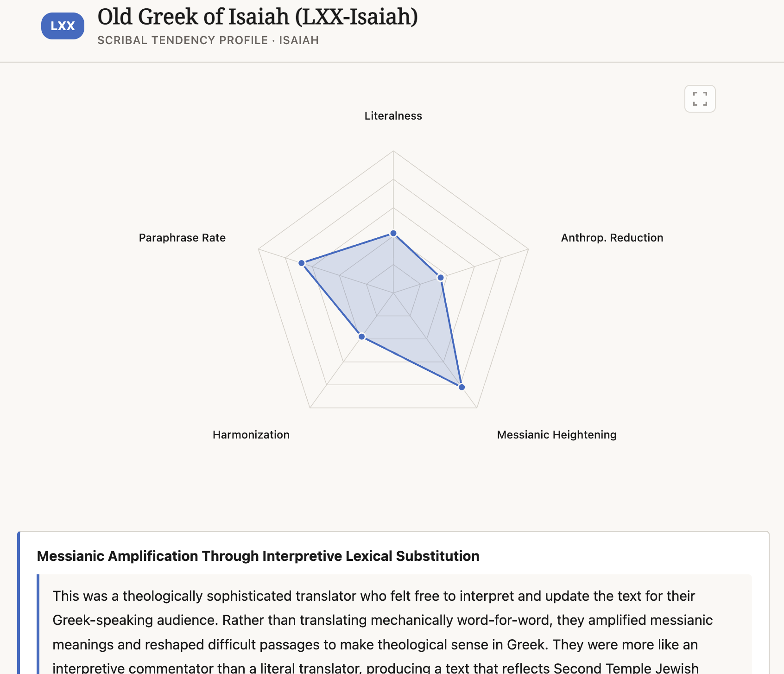
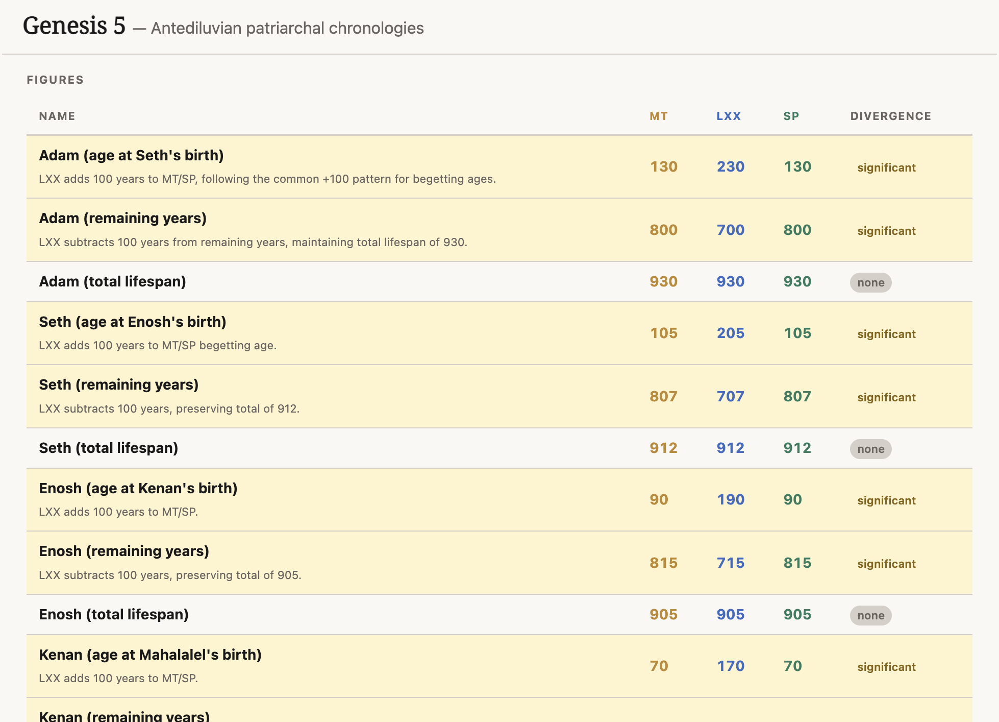
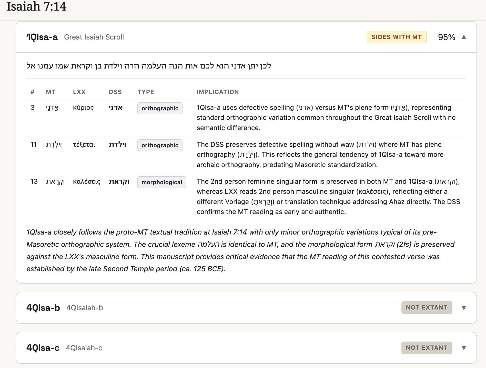
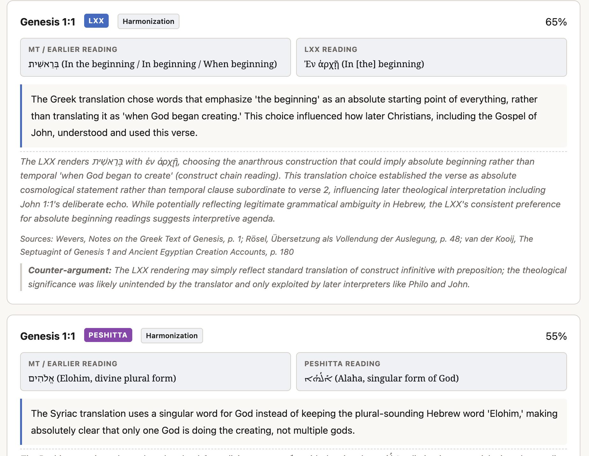
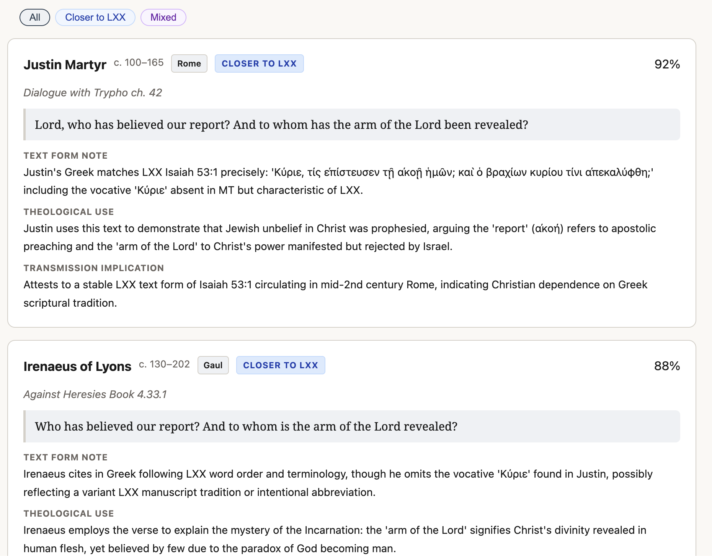
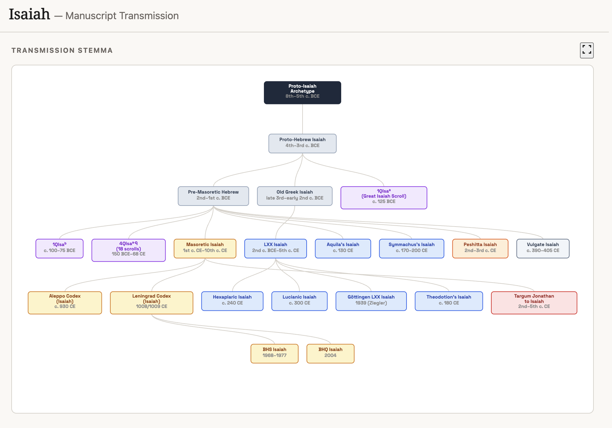

[](https://orcid.org/0009-0000-2026-0836)
[](https://doi.org/10.5281/zenodo.19358424)

# BibCrit

AI-powered biblical textual criticism: compare MT, LXX, and Dead Sea Scrolls, reconstruct Hebrew Vorlagen, profile scribal tendencies, detect theological revisions, track patristic citations, model numerical discrepancies, and visualize manuscript genealogies — all in a browser.

## Screenshots

<table>
<tr>
<td><strong>MT/LXX Divergence Analyzer</strong><br></td>
<td><strong>Back-Translation Workbench</strong><br></td>
</tr>
<tr>
<td><strong>Scribal Tendency Profiler</strong><br></td>
<td><strong>Numerical Discrepancy Modeler</strong><br></td>
</tr>
<tr>
<td><strong>DSS Bridge Tool</strong><br></td>
<td><strong>Theological Revision Detector</strong><br></td>
</tr>
<tr>
<td><strong>Patristic Citation Tracker</strong><br></td>
<td><strong>Manuscript Genealogy</strong><br></td>
</tr>
</table>

---

## Features

### Textual Analysis

| Tool | Route | What it does |
|---|---|---|
| **MT/LXX Divergence Analyzer** | `/divergence` | Side-by-side Hebrew/Greek comparison. Claude classifies every divergence by type (`different_vorlage`, `theological_tendency`, `scribal_error`, etc.), assigns a confidence score, and generates competing scholarly hypotheses. Exports SBL footnotes and BibTeX. |
| **Back-Translation Workbench** | `/backtranslation` | Starting from the LXX Greek, reconstructs the probable Hebrew Vorlage word-by-word using Tov's retroversion methodology. Returns annotated reconstructed words with confidence levels and summary assessments. |

### Critical Analysis

| Tool | Route | What it does |
|---|---|---|
| **Scribal Tendency Profiler** | `/scribal` | Generates a statistical fingerprint of an LXX book's translator across five scholarly dimensions: literalness, anthropomorphism reduction, messianic heightening, harmonization, and paraphrase rate. Rendered as a D3.js radar chart with per-dimension evidence. Supports two-book comparison. |
| **Numerical Discrepancy Modeler** | `/numerical` | Surfaces numerical divergences between MT, LXX, and Samaritan Pentateuch (patriarchal ages, census figures, temple dimensions, etc.) and ranks competing theories — scribal error, theological revision, or different Vorlage — by confidence. |

### Discovery

| Route | What it does |
|---|---|
| `/discovery` | Public-facing, plain-language findings surfaced from the analysis cache. No Hebrew or Greek required. Cards are curated (`discovery_ready` flag) and paginated; a "featured finding" is selected from high-confidence `different_vorlage`, `theological_tendency`, and `scribal_error` entries. Grows automatically as scholars use the other tools (the flywheel). |

### Research Tools

| Tool | Route | What it does |
|---|---|---|
| **DSS Bridge Tool** | `/dss` | Compare a biblical passage across Dead Sea Scrolls manuscripts, the Masoretic Text, and the Septuagint. See which scrolls attest the passage, their alignment with MT or LXX, and specific divergences. |
| **Theological Revision Detector** | `/theological` | Identify where translators or scribes may have altered the text for theological reasons — anthropomorphism avoidance, messianic heightening, polemical changes, or harmonization. |
| **Patristic Citation Tracker** | `/patristic` | Trace how Church Fathers (through the 5th century) cited a biblical passage, what text form they used, and what their citations reveal about early textual transmission. |
| **Manuscript Genealogy** | `/genealogy` | Visualize the full transmission stemma of a biblical book — from proto-text through manuscript families (MT, LXX, DSS, SP, Peshitta, Targum, Vulgate) to modern critical editions. |

---

## Tech Stack

| Layer | Technology |
|---|---|
| Web framework | [Flask](https://flask.palletsprojects.com/) 3.0+ |
| AI analysis | [Anthropic Python SDK](https://github.com/anthropics/anthropic-sdk-python) 0.30+ · model: `claude-sonnet-4-5-20250929` |
| Visualization | [D3.js](https://d3js.org/) v7 (radar charts) |
| Persistence | [Supabase](https://supabase.com/) (analysis cache + budget + votes) · disk JSON fallback |
| Production server | Gunicorn (1 worker, 2 threads) |
| Fonts | Space Grotesk, Noto Sans Hebrew, Noto Serif |
| Deploy target | [Render](https://render.com/) (Python 3.11, `render.yaml` included) |

---

## Architecture

```
BibCrit/
├── app.py                    # Flask app factory; lazy _init() wires corpus + pipeline
├── state.py                  # Shared singletons: corpus, pipeline, i18n, TranslationProxy
├── requirements.txt
├── render.yaml               # One-click Render deploy config
│
├── blueprints/
│   ├── textual.py            # /divergence, /backtranslation, corpus browser API, vote API
│   ├── critical.py           # /scribal, /numerical
│   ├── discovery.py          # /discovery, /api/discovery/cards, /api/admin/discovery/flag
│   └── research.py           # /health (concordance/hapax stub)
│
├── biblical_core/
│   ├── claude_pipeline.py    # ClaudePipeline: Claude calls, Supabase cache, budget tracking
│   ├── corpus.py             # BiblicalCorpus: loads MT (ETCBC) and LXX (STEP) CSVs
│   └── divergence.py         # parse_claude_response, format_sbl_footnote, format_bibtex
│
├── data/
│   ├── i18n.json             # All UI strings (en, es)
│   ├── prompts/              # Versioned prompt templates (divergence_v2.txt, etc.)
│   ├── cache/                # Disk-based analysis cache and budget.json (fallback)
│   └── corpora/
│       ├── mt_etcbc/         # Masoretic Text CSV files (ETCBC morphology)
│       └── lxx_stepbible/    # Septuagint CSV files (STEP Bible)
│
├── templates/                # Jinja2 templates extending base.html
└── static/                   # CSS (bibcrit.css, style.css), JS per-tool, SVG assets
```

**Key design decisions:**

- `state.py` holds no blueprint or app imports, preventing circular dependencies. Blueprints read `state.corpus` and `state.pipeline` directly.
- `app._init()` runs before the first request (thread-safe double-checked locking) to keep startup fast.
- All Claude calls are cached by `sha256(reference | tool | prompt_version | model)`. Supabase is the primary store; disk JSON is always written as fallback.
- SSE (Server-Sent Events) streams real-time progress steps to the browser while Claude thinks. Budget checks happen before every API call.

---

## Getting Started

### 1. Clone

```bash
git clone https://github.com/Jossifresben/bibcrit.git
cd bibcrit
```

### 2. Install dependencies

```bash
python -m venv .venv
source .venv/bin/activate      # Windows: .venv\Scripts\activate
pip install -r requirements.txt
```

### 3. Create `.env`

```bash
cp .env.example .env           # or create from scratch — see table below
```

### 4. Run

```bash
flask run
```

The app is available at `http://127.0.0.1:5000`.

For production-like local testing:

```bash
gunicorn app:app --workers 1 --threads 2 --timeout 120
```

---

## Environment Variables

Create a `.env` file in the project root (or set these in your hosting dashboard):

| Variable | Required | Default | Description |
|---|---|---|---|
| `ANTHROPIC_API_KEY` | Yes | — | Anthropic API key. Without it the analysis tools return a graceful error; all cached results and the corpus browser still work. |
| `BIBCRIT_API_CAP_USD` | No | `10.0` | Monthly Claude spend cap in USD. The app rejects new analysis calls once this is reached and prompts a Ko-fi donation. Resets each calendar month. |
| `SUPABASE_URL` | No | — | Supabase project URL. If unset, all caching and budget tracking fall back to local disk (`data/cache/`). |
| `SUPABASE_KEY` | No | — | Supabase `anon` or `service_role` key. |
| `BIBCRIT_ADMIN_KEY` | No | — | Arbitrary secret for the admin flag endpoint (`POST /api/admin/discovery/flag`). Without it the endpoint returns 403. |

---

## URL Routes

### Pages

| Method | Route | Description |
|---|---|---|
| GET | `/` | Home / landing page |
| GET | `/divergence` | MT/LXX Divergence Analyzer |
| GET | `/backtranslation` | Back-Translation Workbench |
| GET | `/scribal` | Scribal Tendency Profiler |
| GET | `/numerical` | Numerical Discrepancy Modeler |
| GET | `/dss` | DSS Bridge Tool |
| GET | `/theological` | Theological Revision Detector |
| GET | `/patristic` | Patristic Citation Tracker |
| GET | `/genealogy` | Manuscript Genealogy |
| GET | `/discovery` | Discovery — plain-language findings |
| GET | `/guide` | User guide |
| GET | `/health` | Health check (`{"status": "ok"}`) |

### Open Data API

BibCrit's analysis corpus is publicly readable:

```
GET /api/cache
GET /api/cache?tool=divergence
GET /api/cache?tool=theological&ref=Isaiah+7:14
GET /api/cache?discovery_ready=true&limit=50&offset=0
```

**Query parameters:**

| Param | Description | Default |
|---|---|---|
| `tool` | Filter by tool (`divergence`, `backtranslation`, `scribal`, `numerical`, `dss`, `theological`, `patristic`, `genealogy`) | all |
| `ref` | Case-insensitive substring match on reference | all |
| `discovery_ready` | `true` / `false` | all |
| `limit` | Max records per page (max 200) | 50 |
| `offset` | Pagination offset | 0 |

**Response:**
```json
{
  "total": 63,
  "offset": 0,
  "limit": 50,
  "has_more": true,
  "license": "Apache 2.0",
  "citation": "Fresco Benaim, J. (2026). BibCrit...",
  "records": [{ "cache_key", "reference", "tool", "data", ... }]
}
```

All data is released under **Apache 2.0**. If you use BibCrit analyses in research, please cite:
> Fresco Benaim, J. (2026). *BibCrit: AI-assisted biblical textual criticism*. ORCID:[0009-0000-2026-0836](https://orcid.org/0009-0000-2026-0836)

### Analysis API (SSE streaming)

| Method | Route | Query params |
|---|---|---|
| GET | `/api/divergence/stream` | `ref` — e.g. `Isaiah 7:14` |
| GET | `/api/backtranslation/stream` | `ref` |
| GET | `/api/scribal/stream` | `book` — e.g. `Isaiah` |
| GET | `/api/numerical/stream` | `ref` — e.g. `Genesis 5` |

SSE events: `step` (progress message), `done` (final JSON payload), `error`.

### Corpus Browser API

| Method | Route | Query params |
|---|---|---|
| GET | `/api/books` | `tradition=MT\|LXX` |
| GET | `/api/chapters` | `book`, `tradition` |
| GET | `/api/verses` | `book`, `chapter`, `tradition` |

### Export API

| Method | Route | Query params |
|---|---|---|
| GET | `/api/divergence/export/sbl` | `ref` |
| GET | `/api/divergence/export/bibtex` | `ref` |
| GET | `/api/scribal/export/sbl` | `book` |

### Discovery API

| Method | Route | Query params |
|---|---|---|
| GET | `/api/discovery/cards` | `offset`, `limit` (max 50) |
| GET | `/api/budget` | — |

### Admin API

| Method | Route | Query params |
|---|---|---|
| POST | `/api/admin/discovery/flag` | `ref`, `ready=true\|false`, `key` |

### Hypothesis Voting

| Method | Route | Query params |
|---|---|---|
| GET | `/api/hypothesis/votes` | `ref` |
| POST | `/api/hypothesis/vote` | `ref`, `direction=up\|down`, `action=cast\|retract` |

---

## Internationalization

UI strings live in `data/i18n.json`. The `lang` query parameter (`?lang=en`) selects the active language. `state.TranslationProxy` (exposed as `_t()` in all templates) falls back to English if a key is missing in the requested language.

| Language | Code | Status |
|---|---|---|
| English | `en` | Available |
| Spanish | `es` | Available |
| Hebrew | `he` | Planned (RTL wiring already in `base.html`) |
| Dutch | `nl` | Planned |

To add a language, add a new top-level key to `data/i18n.json` matching all existing `en` keys, then add a button to the language picker in `templates/base.html`.

---

## Supabase Schema

The pipeline expects three tables:

```sql
-- Analysis results cache
CREATE TABLE analysis_cache (
  cache_key       TEXT PRIMARY KEY,
  reference       TEXT,
  tool            TEXT,
  prompt_version  TEXT,
  model_version   TEXT,
  data            JSONB,
  cached_at       TIMESTAMPTZ,
  discovery_ready BOOLEAN DEFAULT FALSE
);

-- Monthly API spend tracking
CREATE TABLE budget (
  month       TEXT PRIMARY KEY,   -- e.g. '2026-03'
  spend_usd   NUMERIC,
  cap_usd     NUMERIC,
  updated_at  TIMESTAMPTZ
);

-- Hypothesis voting
CREATE TABLE hypothesis_votes (
  reference   TEXT PRIMARY KEY,
  upvotes     INTEGER DEFAULT 0,
  downvotes   INTEGER DEFAULT 0,
  updated_at  TIMESTAMPTZ
);
```

All three tables are optional — the app falls back to disk if Supabase is unavailable.

---

## Deploy to Render

A `render.yaml` is included. To deploy:

1. Push the repo to GitHub.
2. In the Render dashboard, click **New > Blueprint** and point it at the repo.
3. Set `ANTHROPIC_API_KEY` (and optionally `SUPABASE_URL` / `SUPABASE_KEY` / `BIBCRIT_ADMIN_KEY`) as environment variables.
4. Deploy.

The default `BIBCRIT_API_CAP_USD` is `$10.00/month`. Raise it in the Render environment variables or ask users to donate via Ko-fi.

---

## Roadmap

- [x] DSS Bridge Tool — Dead Sea Scrolls witness comparison
- [x] Manuscript Genealogy — visual stemma builder
- [x] Theological Revision Detector — corpus-wide pattern analysis
- [x] Patristic Citation Tracker — church-father quotation cross-reference
- [ ] Hebrew UI (`he`) with full RTL layout
- [ ] Dutch UI (`nl`)
- [x] Corpus expansion — featured passages across all 8 tools pre-loaded

---

## License

Apache 2.0 — see [LICENSE](LICENSE).

---

## Credits

Built by [Jossi Fresco](https://jossifresco.com). Analysis powered by [Claude](https://anthropic.com) (Anthropic). Corpus data: ETCBC (MT) and STEP Bible (LXX).
