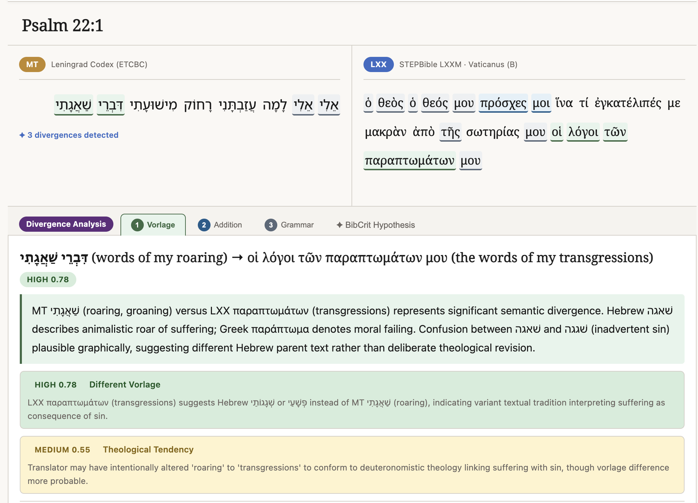
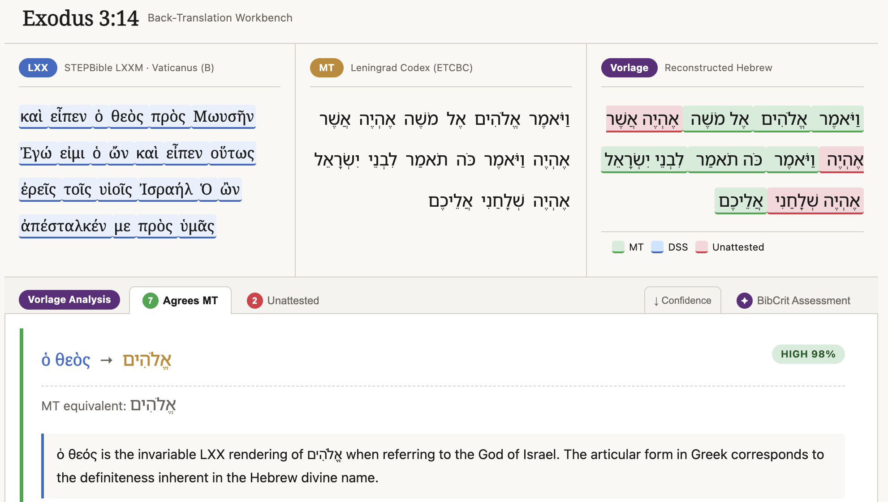
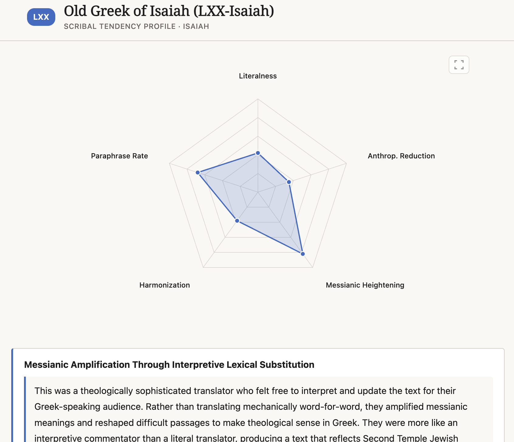
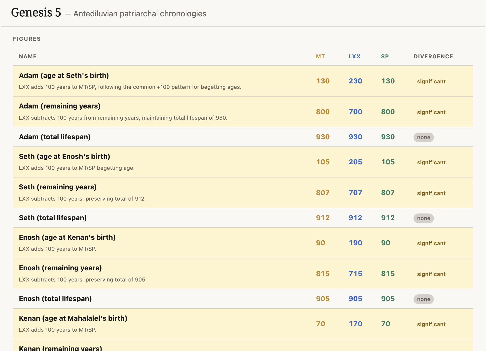
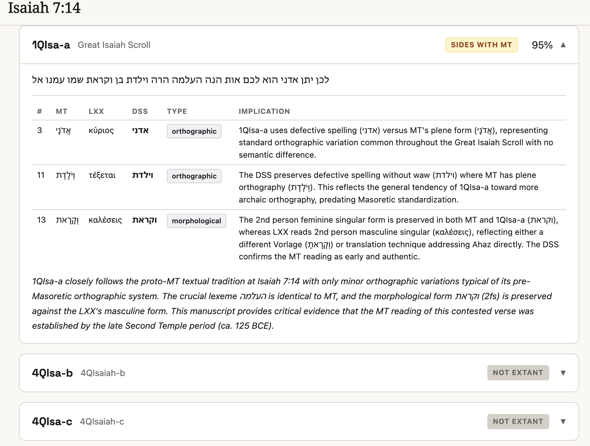
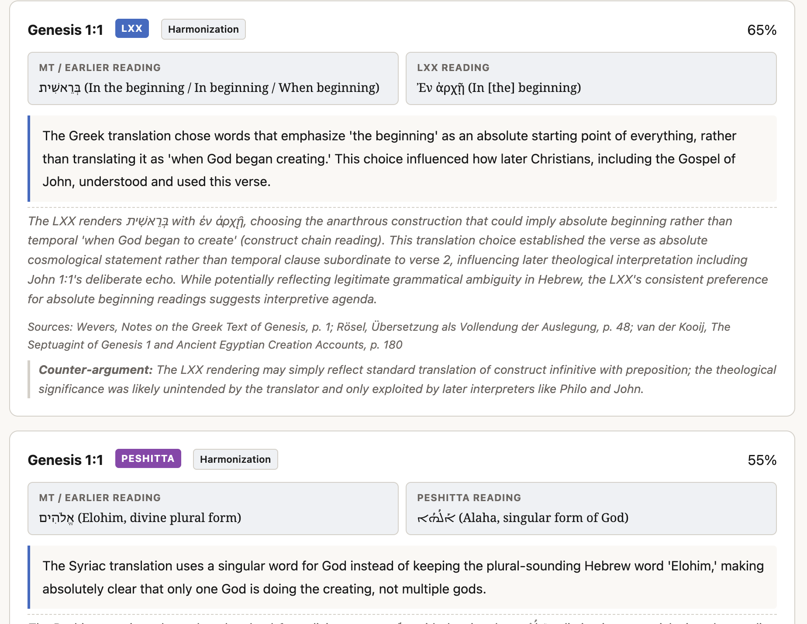
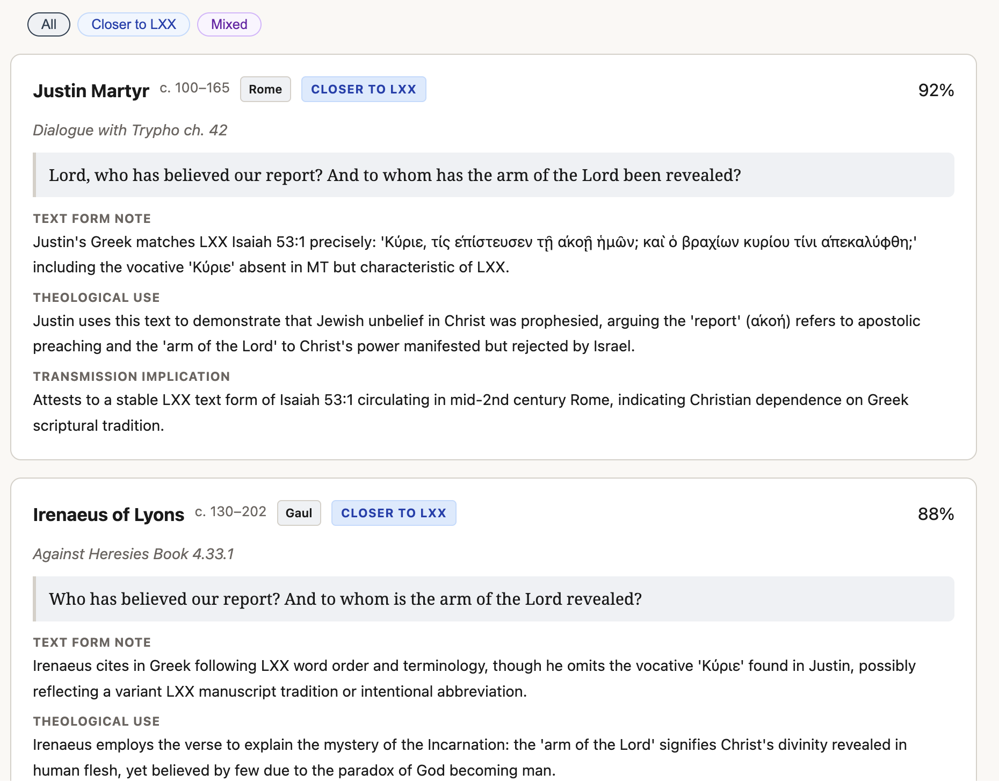
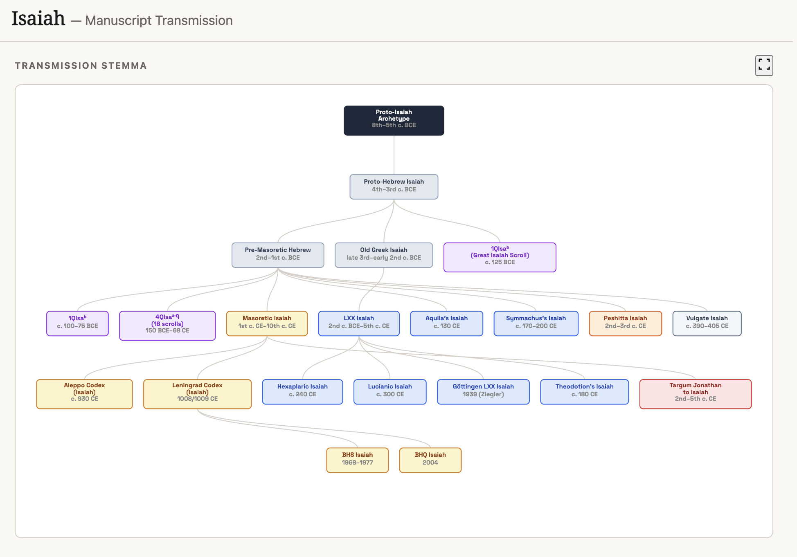

[](https://orcid.org/0009-0000-2026-0836)
[](https://doi.org/10.5281/zenodo.19358424)

# BibCrit v2.0

Free, open-access web tool for biblical textual criticism at [bibcrit.com](https://bibcrit.com). Compare MT, LXX, and Dead Sea Scrolls; reconstruct Hebrew Vorlagen; profile scribal tendencies; detect theological revisions; track patristic citations; model numerical discrepancies; and visualize manuscript genealogies — all in a browser, in English and Spanish.

## Screenshots

<table>
<tr>
<td><strong>MT/LXX Divergence Analyzer</strong><br></td>
<td><strong>Back-Translation Workbench</strong><br></td>
</tr>
<tr>
<td><strong>Scribal Tendency Profiler</strong><br></td>
<td><strong>Numerical Discrepancy Modeler</strong><br></td>
</tr>
<tr>
<td><strong>DSS Bridge Tool</strong><br></td>
<td><strong>Theological Revision Detector</strong><br></td>
</tr>
<tr>
<td><strong>Patristic Citation Tracker</strong><br></td>
<td><strong>Manuscript Genealogy</strong><br></td>
</tr>
</table>

---

## Tools

| # | Tool | Route | Description |
|---|---|---|---|
| 1 | **MT/LXX Divergence Analyzer** | `/divergence` | Word-level Hebrew/Greek comparison with alignment scoring. Claude classifies each divergence (`different_vorlage`, `theological_tendency`, `scribal_error`, etc.), assigns confidence, and generates competing scholarly hypotheses. Exports SBL footnotes, BibTeX, RIS (Zotero), and TEI XML. Prompt: `divergence_v2`. |
| 2 | **Scribal Tendencies Profiler** | `/scribal` | Statistical fingerprint of an LXX book's translator across five dimensions: literalness, anthropomorphism reduction, messianic heightening, harmonization, and paraphrase rate. Rendered as a D3.js radar chart with per-dimension evidence. Supports two-book comparison. Prompt: `scribal_v1`. |
| 3 | **Numerical Discrepancies** | `/numerical` | Surfaces numerical divergences (patriarchal ages, census figures, temple dimensions, etc.) across MT, LXX, and Samaritan Pentateuch, ranking competing theories by confidence. Prompt: `numerical_v3`. |
| 4 | **Ancient Witness Bridge (DSS)** | `/dss` | Compare a passage across Dead Sea Scrolls manuscripts (1QIsaᵃ and others), MT, and LXX. Shows which scrolls attest the passage, MT/LXX alignment, and specific divergences. Prompt: `dss_v5`. |
| 5 | **Theological Revisions** | `/theological` | Identifies theologically motivated textual changes — anthropomorphism avoidance, messianic heightening, polemical alterations, harmonization. Prompt: `theological_v1`. |
| 6 | **Patristic Citation Tracker** | `/patristic` | Traces Church Father citations (1st–5th century), identifies the text form used, and visualizes text-form distribution as a bar chart. Each citation links to [BiblIndex](https://www.biblindex.org) for primary source access. Prompt: `patristic_v3`. |
| 7 | **Back-Translation Workbench** | `/backtranslation` | Reconstructs the probable Hebrew Vorlage word-by-word from LXX Greek using Tov's retroversion methodology, with confidence levels and summary assessments. Prompt: `backtranslation_v1`. |
| 8 | **Manuscript Genealogy** | `/genealogy` | Visualizes the full transmission stemma of a biblical book — from proto-text through manuscript families (MT, LXX, DSS, SP, Peshitta, Targum, Vulgate) to modern critical editions. Prompt: `genealogy_v1`. |

---

## Data Sources

| Corpus | Source | Path |
|---|---|---|
| **MT** | [ETCBC/BHSA](https://github.com/ETCBC/bhsa) via Text-Fabric | `data/corpora/mt_etcbc/` |
| **LXX** | Rahlfs (ingested via `ingest_lxx_rahlfs.py`) | `data/corpora/lxx_stepbible/` |
| **DSS** | [ETCBC/DSS](https://github.com/ETCBC/dss) — 1QIsaᵃ — via Text-Fabric | `data/corpora/dss/` |
| **SP** | [dt-ucph/sp](https://github.com/dt-ucph/sp) via Text-Fabric | `data/corpora/sp_etcbc/` |
| **GNT** | [SBLGNT](https://github.com/LogosBible/SBLGNT) | `data/corpora/gnt_opengnt/` |

**License note:** The ETCBC corpora (MT/BHSA and DSS) are released under [CC-BY-NC 4.0](https://creativecommons.org/licenses/by-nc/4.0/). The app code is Apache 2.0; the corpus data it ingests retains its own license terms. Do not use the ingested ETCBC data for commercial purposes without a separate agreement with ETCBC.

---

## Tech Stack

| Layer | Technology |
|---|---|
| Web framework | [Flask](https://flask.palletsprojects.com/) 3.0+ |
| AI analysis | [Anthropic Python SDK](https://github.com/anthropics/anthropic-sdk-python) 0.30+ · model: `claude-sonnet-4-5-20250929` |
| Visualization | [D3.js](https://d3js.org/) v7 (radar charts, bar charts) |
| Persistence | [Supabase](https://supabase.com/) (PostgreSQL) + disk JSON fallback |
| Production server | Gunicorn (1 worker, 2 threads) |
| Fonts | Space Grotesk, Noto Sans Hebrew, Noto Serif |
| Deploy target | [Render](https://render.com/) (Python 3.11, `render.yaml` included) |

---

## Architecture

```
BibCrit/
├── app.py                      # Flask app factory; lazy _init() wires corpus + pipeline
├── state.py                    # Shared singletons: corpus, pipeline, i18n, TranslationProxy
├── requirements.txt
├── render.yaml                 # One-click Render deploy config
│
├── blueprints/
│   ├── textual.py              # /divergence, /backtranslation, /dss, /genealogy + APIs
│   ├── critical.py             # /scribal, /numerical, /theological, /patristic + APIs
│   ├── discovery.py            # /discovery, /api/discovery/cards, /api/admin/discovery/flag
│   └── research.py             # /health, /guide
│
├── biblical_core/
│   ├── claude_pipeline.py      # ClaudePipeline: Claude calls, Supabase cache, budget tracking
│   ├── corpus.py               # BiblicalCorpus: loads MT, LXX, DSS, SP, GNT
│   └── divergence.py           # parse_claude_response, format_sbl_footnote, format_bibtex
│
├── data/
│   ├── i18n.json               # All UI strings (en, es)
│   ├── prompts/                # Versioned prompt templates ({tool}_{version}.txt)
│   ├── cache/                  # Disk-based analysis cache fallback ({sha256}.json)
│   └── corpora/
│       ├── mt_etcbc/           # Masoretic Text (ETCBC/BHSA morphology)
│       ├── lxx_stepbible/      # Septuagint (Rahlfs)
│       ├── dss/                # Dead Sea Scrolls (ETCBC, primarily 1QIsaᵃ)
│       ├── sp_etcbc/           # Samaritan Pentateuch (dt-ucph/sp via ETCBC)
│       └── gnt_opengnt/        # Greek New Testament (SBLGNT)
│
├── scripts/
│   ├── precache_all.py         # Seed 91 featured passages in English
│   ├── precache_es.py          # Translate all 91 passages to Spanish
│   ├── push_cache_to_supabase.py  # Push disk cache → Supabase
│   ├── ingest_mt.py            # ETCBC/BHSA → CSV
│   ├── ingest_lxx.py           # LXX (STEP) → CSV
│   ├── ingest_lxx_rahlfs.py    # LXX (Rahlfs) → CSV
│   ├── ingest_dss_1qisaa.py    # ETCBC/DSS (1QIsaᵃ) → CSV
│   ├── ingest_sp.py            # SP (dt-ucph/sp) → CSV
│   └── ingest_gnt.py           # SBLGNT → CSV
│
├── templates/                  # Jinja2 templates extending base.html
└── static/                     # CSS (bibcrit.css, style.css), JS per-tool, SVG assets
```

### Key design decisions

- `state.py` holds no blueprint or app imports, preventing circular dependencies. Blueprints read `state.corpus` and `state.pipeline` directly.
- `app._init()` runs before the first request (thread-safe double-checked locking) to keep startup fast.
- SSE (Server-Sent Events) streams real-time progress steps (`step` / `done` / `error` frames) to the browser while Claude analyzes.
- Budget checks happen before every API call; once `spend_usd >= cap_usd` the endpoint returns an error frame without calling the API.

### Cache system

Every analysis result is keyed by:

```
cache_key = SHA256("{reference}|{tool}|{prompt_version}|{model}")
```

**English (EN):** written to both Supabase (`analysis_cache` table) and disk (`data/cache/{sha256}.json`). Supabase is the primary read path; disk is the fallback.

**Spanish (ES):** stored in Supabase only (`analysis_cache_es` table). Generated by `scripts/precache_es.py`, which translates cached EN analyses rather than re-running the full Claude pipeline.

---

## Getting Started

### 1. Clone

```bash
git clone https://github.com/Jossifresben/bibcrit.git
cd bibcrit
```

### 2. Install dependencies

```bash
python -m venv .venv
source .venv/bin/activate      # Windows: .venv\Scripts\activate
pip install -r requirements.txt
```

### 3. Create `.env`

```bash
cp .env.example .env           # or create from scratch — see table below
```

### 4. Run

```bash
flask run
```

The app is available at `http://127.0.0.1:5000`.

For production-like local testing:

```bash
gunicorn app:app --workers 1 --threads 2 --timeout 120
```

---

## Environment Variables

| Variable | Required | Default | Description |
|---|---|---|---|
| `ANTHROPIC_API_KEY` | Yes | — | Anthropic API key. Without it the analysis tools return a graceful error; all cached results and the corpus browser still work. |
| `BIBCRIT_API_CAP_USD` | No | `10.0` | Monthly Claude spend cap in USD. Resets each calendar month. |
| `SUPABASE_URL` | No | — | Supabase project URL. If unset, caching and budget tracking fall back to disk (`data/cache/`). |
| `SUPABASE_KEY` | No | — | Supabase `anon` or `service_role` key. |
| `BIBCRIT_ADMIN_KEY` | No | — | Arbitrary secret for `POST /api/admin/discovery/flag`. Without it the endpoint returns 403. |

---

## Corpus Ingestion

Run ingestion scripts once to populate `data/corpora/`. Each script pulls from Text-Fabric or a local file and writes normalized CSV:

```bash
python scripts/ingest_mt.py
python scripts/ingest_lxx_rahlfs.py
python scripts/ingest_dss_1qisaa.py
python scripts/ingest_sp.py
python scripts/ingest_gnt.py
```

Text-Fabric downloads corpora on first run (~several hundred MB). The ETCBC and SP corpora require acceptance of their respective licenses before use.

---

## Pre-caching Featured Passages

The repo ships with analyses for 91 featured passages across all 8 tools. To seed or refresh:

```bash
# Seed all missing EN analyses (safe to re-run; skips already-cached)
python scripts/precache_all.py

# Seed a specific tool only
python scripts/precache_all.py --type numerical

# Dry run — show what would be seeded without calling the API
python scripts/precache_all.py --dry-run

# Push disk cache to Supabase
python scripts/push_cache_to_supabase.py

# Generate Spanish translations of all cached EN analyses
python scripts/precache_es.py
```

---

## URL Routes

### Pages

| Method | Route | Description |
|---|---|---|
| GET | `/` | Home / landing page |
| GET | `/divergence` | MT/LXX Divergence Analyzer |
| GET | `/backtranslation` | Back-Translation Workbench |
| GET | `/scribal` | Scribal Tendency Profiler |
| GET | `/numerical` | Numerical Discrepancy Modeler |
| GET | `/dss` | Ancient Witness Bridge (DSS) |
| GET | `/theological` | Theological Revision Detector |
| GET | `/patristic` | Patristic Citation Tracker |
| GET | `/genealogy` | Manuscript Genealogy |
| GET | `/discovery` | Discovery — plain-language findings |
| GET | `/guide` | User guide |
| GET | `/health` | Health check (`{"status": "ok"}`) |

### Analysis API (SSE streaming)

All stream endpoints emit `step` (progress), `done` (full JSON result), and `error` frames.

| Method | Route | Key query param |
|---|---|---|
| GET | `/api/divergence/stream` | `ref` — e.g. `Isaiah 7:14` |
| GET | `/api/backtranslation/stream` | `ref` |
| GET | `/api/scribal/stream` | `book` — e.g. `Isaiah` |
| GET | `/api/numerical/stream` | `ref` — e.g. `Genesis 5` |
| GET | `/api/dss/stream` | `ref` |
| GET | `/api/theological/stream` | `ref` |
| GET | `/api/patristic/stream` | `ref` |
| GET | `/api/genealogy/stream` | `ref` |

### Open Data API

BibCrit's analysis corpus is publicly readable:

```
GET /api/cache
GET /api/cache?tool=divergence
GET /api/cache?tool=theological&ref=Isaiah+7:14
GET /api/cache?discovery_ready=true&limit=50&offset=0
```

| Param | Description | Default |
|---|---|---|
| `tool` | Filter by tool (`divergence`, `backtranslation`, `scribal`, `numerical`, `dss`, `theological`, `patristic`, `genealogy`) | all |
| `ref` | Case-insensitive substring match on reference | all |
| `discovery_ready` | `true` / `false` | all |
| `limit` | Max records per page (max 200) | 50 |
| `offset` | Pagination offset | 0 |

All data is released under **Apache 2.0**. If you use BibCrit analyses in research, please cite:
> Fresco Benaim, J. (2026). *BibCrit: AI-assisted biblical textual criticism*. ORCID: [0009-0000-2026-0836](https://orcid.org/0009-0000-2026-0836)

### Corpus Browser API

| Method | Route | Query params |
|---|---|---|
| GET | `/api/books` | `tradition=MT\|LXX` |
| GET | `/api/chapters` | `book`, `tradition` |
| GET | `/api/verses` | `book`, `chapter`, `tradition` |

### Export API

| Method | Route | Query params | Returns |
|---|---|---|---|
| GET | `/api/divergence/export/sbl` | `ref` | SBL-style footnote string per divergence |
| GET | `/api/divergence/export/bibtex` | `ref` | BibTeX `@misc` entries |
| GET | `/api/divergence/export/ris` | `ref` | RIS records (Zotero / Mendeley import) |
| GET | `/api/divergence/export/tei` | `ref` | TEI XML critical apparatus (`<listApp>`) |
| GET | `/api/scribal/export/sbl` | `book` | SBL footnote for scribal profile |

### Discovery API

| Method | Route | Notes |
|---|---|---|
| GET | `/api/discovery/cards` | `offset`, `limit` (max 50) |
| GET | `/api/budget` | Current spend vs. cap |
| POST | `/api/admin/discovery/flag` | `ref`, `ready=true\|false`, `key` (admin only) |

### Hypothesis Voting

| Method | Route | Query params |
|---|---|---|
| GET | `/api/hypothesis/votes` | `ref` |
| POST | `/api/hypothesis/vote` | `ref`, `direction=up\|down`, `action=cast\|retract` |

---

## Internationalization

UI strings live in `data/i18n.json`. The `lang` query parameter (`?lang=es`) selects the active language. `state.TranslationProxy` (exposed as `_t()` in templates) falls back to English if a key is missing.

| Language | Code | Analysis cache | Status |
|---|---|---|---|
| English | `en` | `analysis_cache` (Supabase) + disk | Available |
| Spanish | `es` | `analysis_cache_es` (Supabase only) | Available |
| Hebrew | `he` | — | Planned (RTL wiring in `base.html`) |
| Dutch | `nl` | — | Planned |

To add a language: add a top-level key to `data/i18n.json` matching all `en` keys, and add a button to the language picker in `templates/base.html`.

### Scholar / Student Mode

A toggle in the navbar (book icon) switches between **Scholar mode** (default — full technical analysis) and **Student mode** (plain-language explanations highlighted, technical text hidden). The preference is persisted in `localStorage` under `bibcrit-mode`. No server changes are needed; the mode is purely client-side CSS (`body.mode-student .technical-only { display: none }`).

---

## Supabase Schema

```sql
-- English analysis results cache
CREATE TABLE analysis_cache (
  cache_key       TEXT PRIMARY KEY,
  reference       TEXT,
  tool            TEXT,
  prompt_version  TEXT,
  model_version   TEXT,
  data            JSONB,
  cached_at       TIMESTAMPTZ,
  discovery_ready BOOLEAN DEFAULT FALSE
);

-- Spanish analysis results cache
CREATE TABLE analysis_cache_es (
  cache_key       TEXT PRIMARY KEY,
  reference       TEXT,
  tool            TEXT,
  prompt_version  TEXT,
  model_version   TEXT,
  data            JSONB,
  cached_at       TIMESTAMPTZ
);

-- Monthly API spend tracking
CREATE TABLE budget (
  month       TEXT PRIMARY KEY,   -- e.g. '2026-03'
  spend_usd   NUMERIC,
  cap_usd     NUMERIC,
  updated_at  TIMESTAMPTZ
);

-- Hypothesis voting
CREATE TABLE hypothesis_votes (
  reference   TEXT PRIMARY KEY,
  upvotes     INTEGER DEFAULT 0,
  downvotes   INTEGER DEFAULT 0,
  updated_at  TIMESTAMPTZ
);
```

All tables are optional — the app falls back to disk if Supabase is unavailable (EN only; ES requires Supabase).

---

## Deploy to Render

A `render.yaml` is included. To deploy:

1. Push the repo to GitHub.
2. In the Render dashboard, click **New > Blueprint** and point it at the repo.
3. Set `ANTHROPIC_API_KEY` (and optionally `SUPABASE_URL` / `SUPABASE_KEY` / `BIBCRIT_ADMIN_KEY`) as environment variables.
4. Deploy.

The default spend cap is `$10.00/month`. Raise it via `BIBCRIT_API_CAP_USD` in the Render environment variables.

---

## Roadmap

### ✅ Completed
- [x] 8 analysis tools across textual, critical, and discovery categories
- [x] Full OT corpus coverage — MT (ETCBC) + LXX (Vaticanus) across all books
- [x] 1QIsaᵃ (Dead Sea Scrolls) corpus — DSS Bridge Tool runs on real scroll data
- [x] Samaritan Pentateuch corpus (5 books, 114,889 words)
- [x] MorphGNT / SBLGNT corpus (27 NT books, 137,554 words)
- [x] Spanish translation layer (`analysis_cache_es`) — full UI + analysis output
- [x] 91 featured passages pre-cached across all tools (instant load)
- [x] Persona-based home page — Scholar, PhD Candidate, Student entry points
- [x] Scholar / Student mode toggle (technical vs. plain-language view)
- [x] RIS and TEI XML export for Divergence Analysis
- [x] BiblIndex deep-links in Patristic Citations tool
- [x] Open Data API

### 🔜 Phase 2 — NT Use of OT Analyzer
- [ ] New tool: identify every OT allusion in any NT passage and determine whether the author cited MT or LXX text form (methodology: Beale & Carson, Christopher Stanley, Richard Hays)
- [ ] GNT corpus integration for NT text retrieval
- [ ] 10 high-use NT citation passages pre-cached (Matthew 1:23, Hebrews 1:6, Acts 15:17…)

### 🔜 Phase 3 — Literary Structure Tools
- [ ] **Chiasm Detector** — detect chiastic (A B C B′ A′) and parallel structures; visual arm rendering with color-coded pairs and pivot highlighting (methodology: Lund, Welch, Dorsey)
- [ ] **Source Profile Tool** — identify J/E/D/P linguistic and theological markers per passage; supports Classic DH, Supplementary, and Neo-Documentary frameworks; framed as analytical evidence, not definitive assignment

### 🔜 Phase 4 — New Corpora
- [ ] **Targum corpus** (Onkelos + Jonathan) — Aramaic paraphrase comparison; categorize expansions as theological, halakhic, messianic, divine-name substitution (Memra/Shekhina)
- [ ] **Targum Comparator tool** — dedicated MT vs. Targum analysis view
- [ ] **Extended DSS witnesses** — 4QSamᵃ, 11QPaleoLev, 1QpHab beyond 1QIsaᵃ; fifth column in Ancient Witness Bridge

### 🔜 Languages
- [ ] Hebrew UI (`he`) with full RTL layout
- [ ] Dutch UI (`nl`)

---

## License

Apache 2.0 — see [LICENSE](LICENSE).

Corpus data retains its own licenses: ETCBC/BHSA and ETCBC/DSS are CC-BY-NC 4.0; SP (dt-ucph/sp) and SBLGNT have their own terms. See each upstream repository for details.

---

## Credits

Built by [Jossi Fresco](https://jossifresco.com). Analysis powered by [Claude](https://anthropic.com) (Anthropic). Corpus data: ETCBC (MT, DSS), dt-ucph/sp (Samaritan Pentateuch), Rahlfs (LXX), SBLGNT (GNT).
